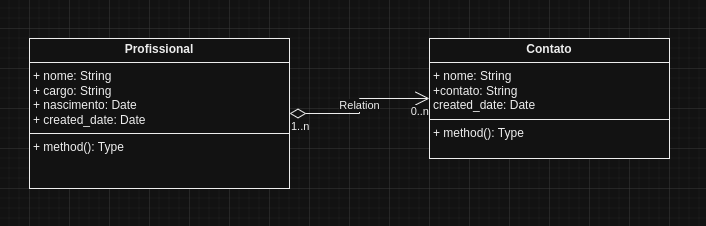

# simples-dental-api
_API desenvolvida para teste de Desenvolvedor Back-End Java._

### _Tecnologias usadas_
`Java17` `SpringBoot3` `SpringDataJPA` `Junit5` `Mockito` `Docker` `PostgreSQL`

### Pré-requisitos:
* Java17
* Maven
* Git
* Docker

### Configurações Default
`Endereço API = ` http://localhost:8080/ <br>
`Endereço Documentação = ` http://localhost:8080/swagger-ui/index.html#/ <br>
`Endereço DB = ` http://localhost:8081/ <br>
`email acesso DB =` admin@root.com <br>
`user DB = ` root <br>
`password DB = ` root <br>

### Como subir o projeto local
````bash
# Clone este repositório 
$ git clone <https://github.com/viniciusalkimin/simples-dental.git>

# Acesse a pasta do projeto no terminal/cmd 
$ cd simples-dental

# Suba o container com o banco de dados PostgreSQL e PGAdmin
$ docker compose up -d
````
### Compilar e executar testes de unidade
_Ainda no diretório do projeto_.

`mvn clean`
Remove directory _target_

`mvn compile`
Compila o projeto

`mvn test`
Executa todos os testes

### End-points
*Gestão de profisisonais*<br>
`http://localhost:8080/simples-dental-api/v1/profissionais`

*Gestão de contatos*<br>
`http://localhost:8080/simples-dental-api/v1/contatos`


## UML
